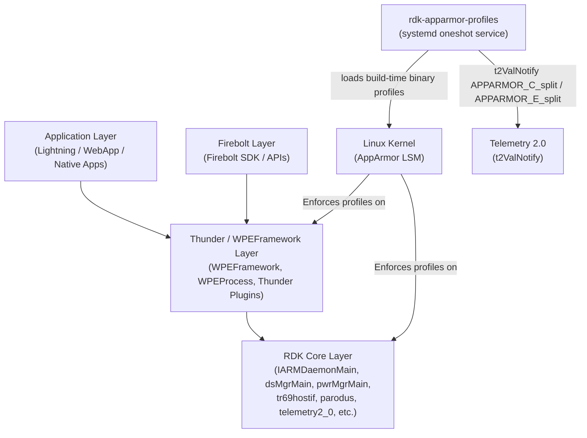
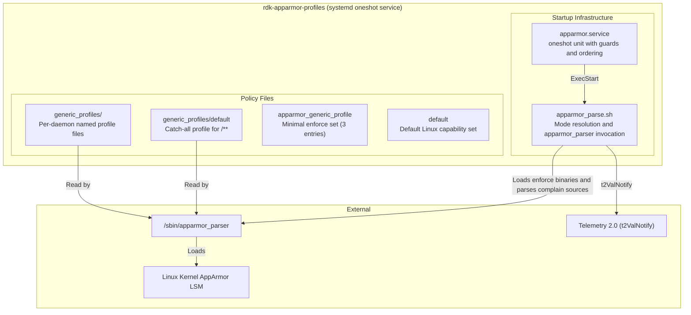
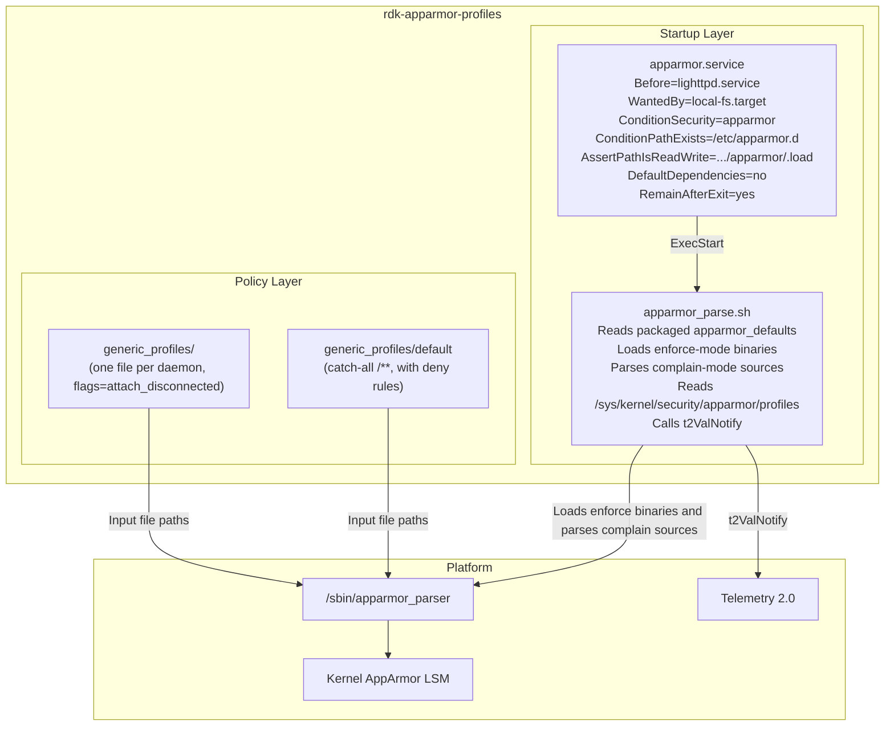
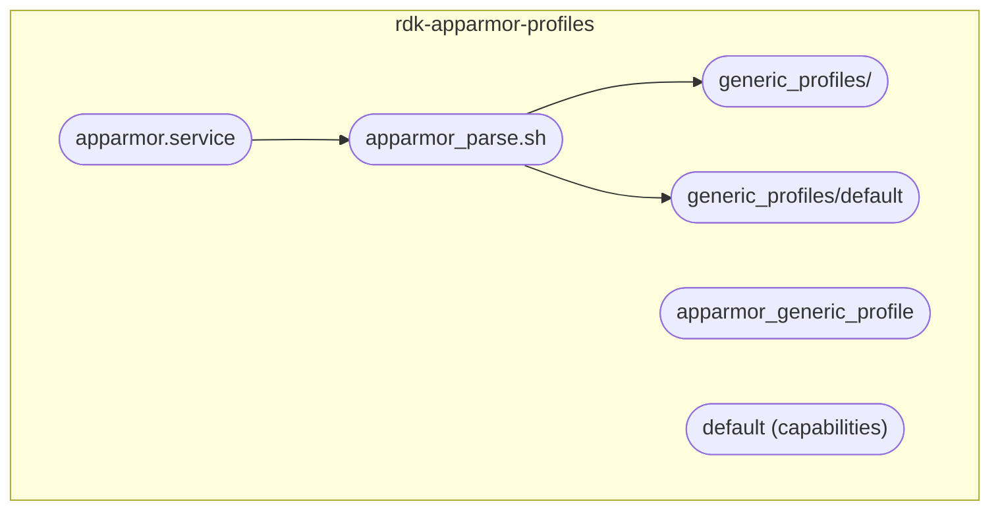
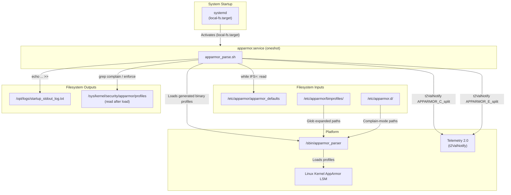
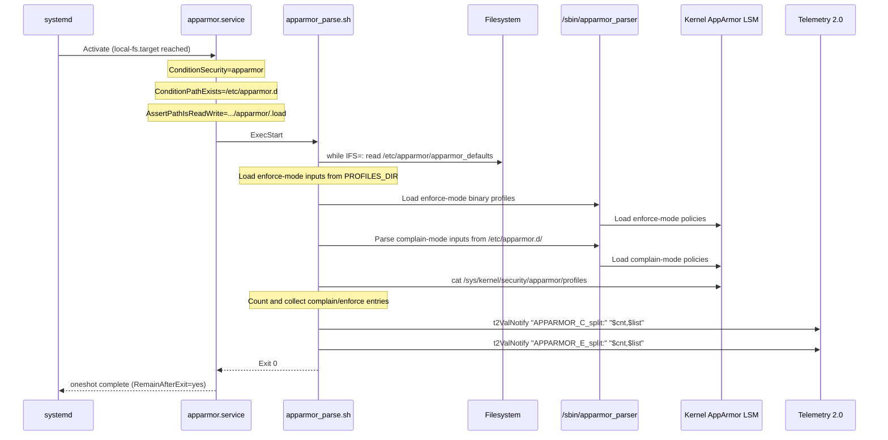
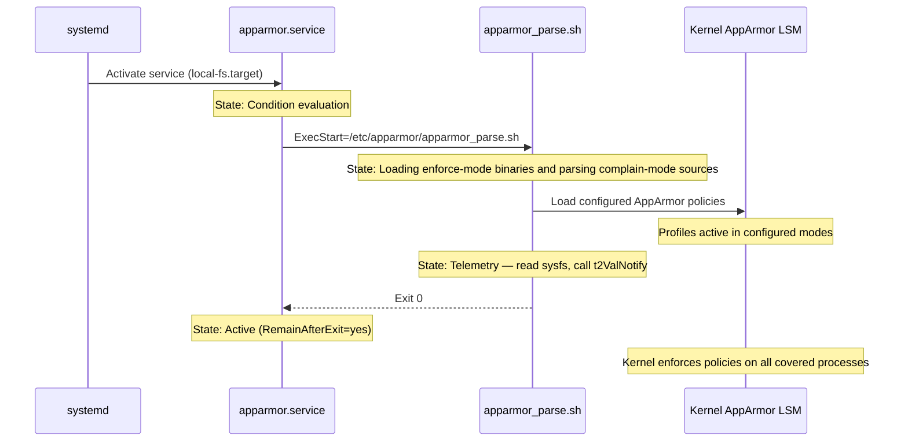
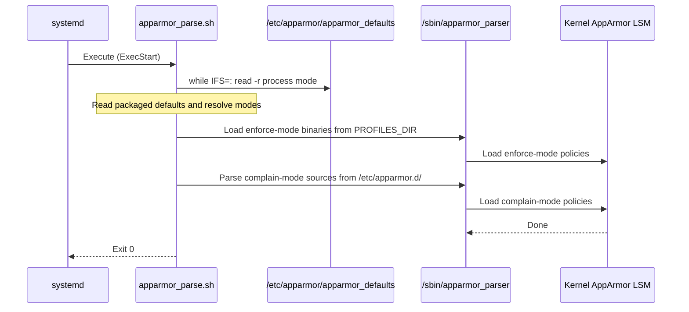

# rdk-apparmor-profiles

---

## Overview

`rdk-apparmor-profiles` is an RDK-E/RDK-V platform component that provides AppArmor Mandatory Access Control security profiles for RDK daemons and services. AppArmor is a Linux kernel security module that confines processes to a defined set of permitted resources. This repository contains the per-process profile files, the systemd service unit that triggers profile loading at boot, the shell script that performs mode resolution and loading, and a Python-based CI/CD tool that detects security violations in profile changes.

At the device level, this component enforces access restrictions on RDK daemons and services, including middleware services (`IARMDaemonMain`, `dsMgrMain`, `pwrMgrMain`, `tr69hostif`, `parodus`, `webconfig`) and the WPEFramework processes (`WPEFramework`, `WPEProcess`). Each process is confined to the files, capabilities, and kernel objects explicitly listed in its profile. A profile operates in either `enforce` mode (violations are denied and logged by the kernel) or `complain` mode (violations are logged but not denied). Enforce-mode profiles are generated as binaries during the image build, while complain-mode profiles are parsed at service start; runtime blocklist overrides are not used.

At the module level, this component delivers: `apparmor.service` — a systemd oneshot unit that loads profiles before `lighttpd.service` starts; `apparmor_parse.sh` — a shell script that reads the build-time defaults file, loads the generated binary profiles, and emits telemetry; a set of named per-daemon profile sources under `generic_profiles/`; and `apparmor_cicd.py` — a Python security violation checker used in CI via a GitHub Actions workflow.



**Key Features & Responsibilities:**

- **Per-process AppArmor profiles**: Each RDK daemon has a named profile file in `generic_profiles/` with an explicit set of allowed file paths and, where required, Linux capabilities, network, signal, ptrace, dbus, and unix rules. The `flags=(attach_disconnected)` flag is present on all profiles.
- **Build-time profile generation**: Enforce-mode profile sources are converted to binary form during the RDK image build, while complain-mode sources are parsed at service start.
- **Vendor profile extension**: Profiles may optionally include `#include if exists "/etc/apparmor.d/vendor/<profile>"`, allowing platform-specific additions to be layered over generic profiles without modifying the base files.
- **Telemetry reporting**: After loading profiles, `apparmor_parse.sh` reads `/sys/kernel/security/apparmor/profiles`, counts processes in each mode, and calls `t2ValNotify "APPARMOR_C_split:"` and `t2ValNotify "APPARMOR_E_split:"` with the count and process name list.
- **CI/CD security violation detection**: `apparmor_cicd.py` and `.github/workflows/apparmor_violation_check.yml` check every changed profile file in a pull request against a defined `check_list` of 20 `SecurityCheckRule` entries and fail the CI job if new violations are introduced.
- **Default catch-all profile**: `generic_profiles/default` applies to all processes not matched by a named profile (`/**`). It grants broad access but explicitly denies writes to `/sys/firmware/`, `/proc/sysrq-trigger`, `/proc/kcore`, and selected `/proc/sys/kernel/` paths.

---

## Architecture

### High-Level Architecture

The component is structured into three distinct parts: startup infrastructure, policy sources, and development tooling. These parts operate independently — the startup infrastructure runs once at boot, the policy sources are converted to binary profiles for enforce-mode loading during the image build, and the development tooling runs only in CI. The startup infrastructure consists of `apparmor.service` and `apparmor_parse.sh`. The service unit declares ordering constraints and guards, then delegates loading to the shell script. The shell script reads the packaged defaults at boot, loads enforce-mode inputs from `PROFILES_DIR`, and parses complain-mode inputs from `/etc/apparmor.d/`.

Northbound, the component integrates with systemd via a oneshot unit. `apparmor.service` declares `Before=lighttpd.service` and `WantedBy=local-fs.target`. The `DefaultDependencies=no` directive prevents implicit systemd ordering from interfering. The unit skips silently if `ConditionSecurity=apparmor` fails (AppArmor not enabled in kernel) or if `ConditionPathExists=/etc/apparmor.d` fails. It fails with an assertion error if `AssertPathIsReadWrite=/sys/kernel/security/apparmor/.load` is not satisfied. Southbound, the component calls `apparmor_parser` to load compiled profiles into the kernel. Loaded policies are then enforced by the kernel's AppArmor LSM against all covered processes for the duration of the system session.

`apparmor_parse.sh` reads the packaged defaults at boot, loads enforce-mode inputs from `PROFILES_DIR`, parses complain-mode inputs from `/etc/apparmor.d/`, and calls `t2ValNotify` from `/lib/rdk/t2Shared_api.sh` (sourced if the file is present) for one-way telemetry after loading.

There is no supported runtime profile configuration file. Profile sources, generated binaries, and the defaults file are packaged in the image and remain unchanged at runtime. Legacy blocklist handling retained in `apparmor_parse.sh` is not used in the supported deployment flow.

A component diagram showing the component's internal structure and dependencies is given below:



### Threading Model

- **Threading Architecture**: Single-threaded. `apparmor_parse.sh` is a shell script executed once as a systemd oneshot service. `apparmor_cicd.py` is a single-threaded Python program.
- **Main Thread**: Sequential execution — read packaged defaults, load enforce-mode binaries, parse complain-mode sources, read sysfs, emit telemetry.
- **Synchronization**: Systemd service ordering (`Before=lighttpd.service`, `WantedBy=local-fs.target`) ensures profiles are loaded before `lighttpd.service` starts; other services must be ordered after `apparmor.service` by the platform/integration to guarantee the same.
- **Execution model**: Sequential oneshot — the service runs to completion at boot and exits after profile loading is done.

---

## Design

The component separates policy from mechanism. Profile sources in `generic_profiles/` contain only AppArmor policy rules and are independent of the loading logic. The image build converts these sources to binary profiles, while `apparmor_parse.sh` loads the generated binaries at startup. This keeps policy rules in source control while avoiding target-side compilation. Legacy blocklist handling remains in the script but is not part of the supported deployment flow.

The packaged defaults determine the effective mode for each process. At boot, `apparmor_parse.sh` loads enforce-mode binaries from `PROFILES_DIR` and parses complain-mode sources from `/etc/apparmor.d/`; no runtime blocklist override is used.

Northbound interaction is via systemd service ordering only. Profiles are generated during the image build and loaded once at boot; mode changes require a new image. Southbound, the only interaction is via `/sbin/apparmor_parser` and the kernel sysfs path at `/sys/kernel/security/apparmor/`.

Profile configuration is build-time only. Profile sources, generated binaries, and `/etc/apparmor/apparmor_defaults` are packaged in the image and remain unchanged at runtime; no supported persistent runtime override file is used.

### Component Diagram

A component diagram showing the internal structure and sub-module dependencies is given below:



---

## Internal Modules

| Module / Class                 | Description                                                                                                                                                                                                                                                                                                                                                                                                                                                                               | Key Files                                                                                 |
| ------------------------------ | ----------------------------------------------------------------------------------------------------------------------------------------------------------------------------------------------------------------------------------------------------------------------------------------------------------------------------------------------------------------------------------------------------------------------------------------------------------------------------------------- | ----------------------------------------------------------------------------------------- |
| `apparmor.service`             | Systemd oneshot service unit. Declares startup guards (`ConditionSecurity=apparmor`, `ConditionPathExists=/etc/apparmor.d`, `AssertPathIsReadWrite=/sys/kernel/security/apparmor/.load`), ordering (`Before=lighttpd.service`, `WantedBy=local-fs.target`), `DefaultDependencies=no`, `RemainAfterExit=yes`, and invokes `apparmor_parse.sh` as `ExecStart`.                                                                                                                              | `apparmor.service`                                                                        |
| `apparmor_parse.sh`            | Shell script that reads `/etc/apparmor/apparmor_defaults`, loads enforce-mode inputs from `PROFILES_DIR`, parses complain-mode inputs from `/etc/apparmor.d/`, reads `/sys/kernel/security/apparmor/profiles`, writes to `/opt/logs/startup_stdout_log.txt`, and calls `t2ValNotify`. Legacy blocklist handling remains in the source for compatibility but is not used in the supported deployment flow. Sources `/lib/rdk/apparmor_utils.sh` and `/lib/rdk/t2Shared_api.sh` if present. | `apparmor_parse.sh`                                                                       |
| `generic_profiles/`            | Per-daemon AppArmor profile files. Each defines one named profile with `flags=(attach_disconnected)` and explicit allow rules for files, capabilities, network, signal, ptrace, dbus, and unix. Some profiles may optionally include `#include if exists "/etc/apparmor.d/vendor/<name>"`.                                                                                                                                                                                                | `generic_profiles/usr.bin.*`, `generic_profiles/usr.sbin.*`, `generic_profiles/usr.lib.*` |
| `generic_profiles/default`     | Named profile `default` attached to `/**`. Grants `capability`, `network`, `mount`, `remount`, `umount`, `pivot_root`, `ptrace`, `signal`, `dbus`, `unix`, `/{,**} mrwlk`, `/{,**} pix`, `change_profile -> **`. Explicitly denies writes to `/sys/f[^s]*/**`, `/sys/firmware/**`, selected `/proc/sys/kernel/` paths, `/proc/sysrq-trigger rwklx`, `/proc/kcore rwklx`.                                                                                                                  | `generic_profiles/default`                                                                |
| `apparmor_generic_profile`     | Three-entry defaults file listing the minimal enforce set shipped in the repository: `default:enforce`, `audiocapturemgr:enforce`, `lighttpd:enforce`.                                                                                                                                                                                                                                                                                                                                    | `apparmor_generic_profile`                                                                |
| `default`                      | One-line file listing the default Linux capabilities: `capability chown dac_read_search fowner fsetid kill ipc_lock sys_nice setpcap ipc_owner sys_ptrace sys_chroot net_bind_service net_admin sys_resource,`.                                                                                                                                                                                                                                                                           | `default`                                                                                 |
| `SecurityCheckRule`            | Python class. Each instance holds a violation rule: `objtype`, `name` (unique string), `rule` (two-element tuple: `(CheckType, CheckData)`), `msg`, `raw` (bool), `priority` (`"High"`, `"Medium"`, `"Low"`). `checkRule()` performs either raw regex match or typed permission-character match depending on `raw` and `objtype`. `getProfileType()` identifies rule type from first token.                                                                                               | `apparmor_cicd.py`                                                                        |
| `SecurityCheck`                | Python class. Runs all `check_list` entries against one profile file. `skip_list` excludes lines starting with `{`, `}`, `#include`, `profile `. Tracks violations in `self.violations` list and `self.violation_dict` (keyed `"<rule_name>:<line>"`). Implements `checkExceptions()` against `exception_list` (empty in current source).                                                                                                                                                 | `apparmor_cicd.py`                                                                        |
| `apparmor_violation_check.yml` | GitHub Actions workflow, triggered on pull requests (paths-ignore: `**/*.sh`, `**/*.md`, `**/*.conf`). Within the job, non-profile files are skipped; for each changed file that contains a `profile` header, it runs `python3 ./apparmor_cicd.py -f <new_file> -a <old_file> -N <repo_path>` and fails CI if new violations are introduced (non-zero exit) or output matches `Total violations found in file: [1-9][0-9]*`.                                                              | `.github/workflows/apparmor_violation_check.yml`                                          |



---

## Prerequisites & Dependencies

- [x] **Build-time policy store**: Profile sources, generated binaries, and `/etc/apparmor/apparmor_defaults` are packaged in the image; no runtime profile override file is used.
- [x] **Systemd services**: `apparmor.service` declares `Before=lighttpd.service`.
- [x] **Configuration files**: `/etc/apparmor/apparmor_defaults` is supplied at image build time. `/etc/apparmor.d` existence is verified via `ConditionPathExists`.

### Platform Requirements

- **Build Dependencies**: AppArmor userspace tools (`apparmor_parser` at `/sbin/apparmor_parser`). Linux kernel with `CONFIG_SECURITY_APPARMOR=y` (enforced at runtime by `ConditionSecurity=apparmor`).
- **Systemd Services**: The service runs before `lighttpd.service` and is attached to `local-fs.target`.
- **Configuration Files**:
  - `/etc/apparmor/apparmor_defaults` — required; lists process names and default modes.
  - `/etc/apparmor.d` — directory must exist (`ConditionPathExists=/etc/apparmor.d`).
  - `/etc/apparmor/binprofiles/` — glob base directory for enforce-mode profile paths (hardcoded as `PROFILES_DIR="/etc/apparmor/binprofiles/*/"`).
  - `/lib/rdk/apparmor_utils.sh` — optional; sourced with `if [ -f /lib/rdk/apparmor_utils.sh ]`.
  - `/lib/rdk/t2Shared_api.sh` — optional; sourced with `if [ -f /lib/rdk/t2Shared_api.sh ]`.
- **Startup Order**: `local-fs.target` → `apparmor.service` → `lighttpd.service`. `DefaultDependencies=no` disables implicit systemd ordering.
- **Kernel sysfs**: `/sys/kernel/security/apparmor/.load` must be read-write (`AssertPathIsReadWrite`). `/sys/kernel/security/apparmor/profiles` is read after loading to build telemetry.

---

## Quick Start

### 1. Install profiles

Profile sources from `generic_profiles/` are converted to binary profiles for enforce-mode loading during the RDK image build and installed into `/etc/apparmor/binprofiles/*/`. Complain-mode profile sources are installed into `/etc/apparmor.d/` and parsed by `apparmor_parse.sh` at service start. `apparmor.service` is installed into the systemd unit directory.

### 2. Enable and start the service

```bash
systemctl enable apparmor.service
systemctl start apparmor.service
```

### 3. Verify loaded profiles

```bash
# Lists all loaded profiles and their current mode (enforce/complain)
cat /sys/kernel/security/apparmor/profiles
```

### 4. Check startup log output

```bash
grep -i apparmor /opt/logs/startup_stdout_log.txt
```

---

## Configuration

### Configuration Priority

Profile modes are read from the packaged `/etc/apparmor/apparmor_defaults` at boot. Enforce-mode inputs use the build-time generated binaries under `PROFILES_DIR`; complain-mode inputs are parsed from `/etc/apparmor.d/` by `apparmor_parse.sh`. No runtime blocklist override is used.

### Key Configuration Files

| Configuration File                      | Purpose                                                                                                                                            | Override Mechanism              |
| --------------------------------------- | -------------------------------------------------------------------------------------------------------------------------------------------------- | ------------------------------- |
| `/etc/apparmor/apparmor_defaults`       | Lists each process and its default enforcement mode. Format: `process:mode` per line. Consumed during the image build to generate binary profiles. | Replace during the image build  |
| `/etc/apparmor.d/vendor/usr.bin.<name>` | Optional vendor-specific profile extension. Included via `#include if exists` in each generic profile.                                             | Deploy file at the include path |

### Configuration Parameters

| Parameter        | Location                          | Valid Values                             | Description                                                                       |
| ---------------- | --------------------------------- | ---------------------------------------- | --------------------------------------------------------------------------------- |
| `process:mode`   | `/etc/apparmor/apparmor_defaults` | `enforce`, `complain`                    | Build-time enforcement mode for the named process                                 |
| `PROFILES_DIR`   | `apparmor_parse.sh` (hardcoded)   | `/etc/apparmor/binprofiles/*/`           | Glob base used to build enforce-mode profile paths                                |
| `PARSER`         | `apparmor_parse.sh` (hardcoded)   | `/sbin/apparmor_parser`                  | Path to the `apparmor_parser` binary                                              |
| `profile_binary` | `apparmor_parse.sh` (legacy)      | `true`                                   | Legacy parser flag; deployed profiles are converted to binary at image build time |
| `RDKLOGS`        | `apparmor_parse.sh` (hardcoded)   | `/opt/logs/startup_stdout_log.txt`       | Path for startup log output                                                       |
| `SYSFS_AA_PATH`  | `apparmor_parse.sh` (hardcoded)   | `/sys/kernel/security/apparmor/profiles` | Kernel sysfs path read after profile load                                         |

### Configuration Persistence

Enforce-mode profile binaries are generated during the image build and packaged in the image. Complain-mode profile sources and `apparmor_defaults` are packaged and consumed at service start; there is no supported persistent runtime mode override.

---

## API / Usage

### Interface Type

`rdk-apparmor-profiles` is a systemd oneshot service. Its profile inputs are packaged during the image build, and its runtime interaction is limited to loading the generated binaries and emitting telemetry.

### Events / Notifications

The `t2ValNotify` calls in `apparmor_parse.sh` emit one-way telemetry after profile loading completes. See the Events Published table in the Component Interactions section for telemetry marker details.

---

## Component Interactions



### Interaction Matrix

| Target Component / Layer     | Interaction Purpose                                                                      | Key Commands / Paths                                                                           |
| ---------------------------- | ---------------------------------------------------------------------------------------- | ---------------------------------------------------------------------------------------------- |
| **Platform**                 |                                                                                          |                                                                                                |
| `/sbin/apparmor_parser`      | Loads the build-time generated binary AppArmor profiles into the kernel                  | `apparmor_parser` with generated binary profile inputs                                         |
| Linux Kernel AppArmor LSM    | Stores and enforces loaded profiles for the lifetime of the system session               | `/sys/kernel/security/apparmor/.load`, `/sys/kernel/security/apparmor/profiles`                |
| **RDK Runtime Libraries**    |                                                                                          |                                                                                                |
| `/lib/rdk/t2Shared_api.sh`   | Provides `t2ValNotify`. Sourced if file exists at service start                          | `source /lib/rdk/t2Shared_api.sh`                                                              |
| `/lib/rdk/apparmor_utils.sh` | Optional utilities (`systemd_apparmor`, `apparmor_telemetry`). Sourced if file exists    | `source /lib/rdk/apparmor_utils.sh`                                                            |
| **Telemetry**                |                                                                                          |                                                                                                |
| Telemetry 2.0                | Receives complain-mode and enforce-mode profile counts and process name lists after load | `t2ValNotify "APPARMOR_C_split:" "$cnt,$list"`, `t2ValNotify "APPARMOR_E_split:" "$cnt,$list"` |
| **Systemd**                  |                                                                                          |                                                                                                |
| `lighttpd.service`           | Startup ordering — AppArmor service completes before lighttpd starts                     | `Before=lighttpd.service` in unit file                                                         |

### Events Published

| Telemetry Marker    | Trigger Condition                                                | Payload                                     |
| ------------------- | ---------------------------------------------------------------- | ------------------------------------------- |
| `APPARMOR_C_split:` | After profile load, if one or more profiles are in complain mode | `"<count>,<comma-separated profile names>"` |
| `APPARMOR_E_split:` | After profile load, if one or more profiles are in enforce mode  | `"<count>,<comma-separated profile names>"` |

### IPC Flow Patterns

**Profile Load Flow:**



---

## Component State Flow

### Initialization to Active State



### Runtime State Changes

Once `apparmor.service` completes, AppArmor policies are enforced by the kernel for the duration of the session. The oneshot service exits after profile loading; the kernel LSM takes over all subsequent enforcement.

**Profile changes take effect at image build time**: Changes to profile sources or default modes require regenerating the binary profiles and deploying a new image. The runtime service only loads the packaged policies.

**Kernel enforcement**: If a profiled process attempts an access not listed in its profile, the kernel denies it (enforce mode) or logs it (complain mode). Per-access enforcement is handled entirely by the kernel LSM at runtime.

---

## Call Flows

### Initialization Call Flow



---

## Implementation Details

### Key Implementation Logic

- **Profile loading**: `apparmor_parse.sh` reads the packaged defaults at boot, loads enforce-mode inputs from `PROFILES_DIR`, and parses complain-mode inputs from `/etc/apparmor.d/`.

- **Enforce-mode binaries**: Enforce-mode profile sources are converted to binary form during the image build for boot-up optimization. The service loads those generated binaries at startup.

- **Complain-mode parsing**: Complain-mode profile sources remain under `/etc/apparmor.d/` and are parsed by `apparmor_parser -rWC` at service start.

- **Telemetry**: After loading, `apparmor_parse.sh` reads `/sys/kernel/security/apparmor/profiles`, filters for `complain` and `enforce` lines with `grep`, counts with `wc -l`, and joins process names with `tr '\n' ','`. The result is written to `/opt/logs/startup_stdout_log.txt` via `echo ... >> $RDKLOGS` and passed to `t2ValNotify`.

- **Optional hook functions**: After the `apparmor_parser` invocations, `apparmor_parse.sh` calls `systemd_apparmor` if `type systemd_apparmor` succeeds, and `apparmor_telemetry` if `type apparmor_telemetry` succeeds. Both functions are expected to come from `/lib/rdk/apparmor_utils.sh` when sourced.

- **`check_list` in `apparmor_cicd.py`**: Contains 20 `SecurityCheckRule` entries. Rules are either raw regex (`raw=True`, `rule[0]=None`) matched against the full profile line, or typed (`rule[0]="Permissions"`) for file permission character matching. Priority distribution in the list: `"High"` (default for most), `"Medium"` (5 rules: `CAP_SYSADMIN`, `FILE_ALLDEV`, `FILE_ALLMINIDUMP`, `PROC_ATTR_W`, `FILE_ALL_TMP`), `"Low"` (4 rules: `CAP_DACOVERRIDE`, `FILE_ETCAPPARMOR_R`, `PROC_MAPS`, `FILE_ALL_LOGS`).

- **Diff mode in `apparmor_cicd.py`**: `__diff_files()` runs `__check_file()` on both the new and old versions with `silent=True`. It compares `violation_dict` key counts: for each key where the new count exceeds the old count, the extra occurrences are added to `new_only`. Results are deduplicated with a `seen` set before printing. The function returns `True` if new violations are found, causing the CI workflow to exit 1.

- **`exception_list`**: Defined as an empty list (`exception_list = []`) in `apparmor_cicd.py`. The `SecurityException` class is available for registering per-rule exceptions; the current empty list means all violations are reported without exception.

- **Logging**: `apparmor_parse.sh` writes to `/opt/logs/startup_stdout_log.txt` via `echo ... >> $RDKLOGS`. `apparmor_cicd.py` writes diagnostic output to stdout.

---

## Data Flow

```
[System boot — systemd reaches local-fs.target]
        |
        v
[apparmor.service activated — ConditionSecurity, ConditionPathExists, AssertPathIsReadWrite evaluated]
        |
        v
[Packaged /etc/apparmor/apparmor_defaults selects modes
 — enforce profiles are converted to binary during image build]
    |
    v
[apparmor.service activates at boot]
    |
    v
[apparmor_parse.sh loads enforce binaries and parses complain-mode sources
 — complain sources are read from /etc/apparmor.d/]
        |
        v
[Read /sys/kernel/security/apparmor/profiles
 — grep complain/enforce, count with wc -l, join names with tr]
        |
        v
[Write counts and name lists to /opt/logs/startup_stdout_log.txt]
        |
        v
[t2ValNotify "APPARMOR_C_split:" and "APPARMOR_E_split:" emitted]
        |
        v
[apparmor_parse.sh exits 0 — kernel enforces loaded policies on all covered processes]
```

---

## Error Handling

### Layered Error Handling

| Layer                                  | Error Condition                                                                 | Handling Strategy                                                                                   |
| -------------------------------------- | ------------------------------------------------------------------------------- | --------------------------------------------------------------------------------------------------- |
| Image build validation                 | Invalid profile source or mode                                                  | Binary profile generation fails and the image build must be corrected                               |
| Systemd condition (`apparmor.service`) | `ConditionSecurity=apparmor` false — AppArmor not enabled in kernel             | Service skips silently; no profiles are loaded                                                      |
| Systemd condition (`apparmor.service`) | `ConditionPathExists=/etc/apparmor.d` false                                     | Service skips silently                                                                              |
| Systemd assertion (`apparmor.service`) | `AssertPathIsReadWrite=/sys/kernel/security/apparmor/.load` fails               | Service activation fails                                                                            |
| Profile parsing (`apparmor_cicd.py`)   | No `profile ` header line found in file                                         | `errorOut(False, ...)` warning printed, file appended to `g_skipped_files`, function returns `None` |
| Rule matching (`apparmor_cicd.py`)     | `getProfileType()` returns `"None"` for unrecognised rule format                | `errorOut(False, ...)` warning printed, `False` returned for that rule, processing continues        |
| CI/CD (`apparmor_violation_check.yml`) | Python checker exits non-zero                                                   | `EXIT_CODE=1`; CI job exits 1 at end of loop                                                        |
| CI/CD (`apparmor_violation_check.yml`) | Python exits 0 but output matches `Total violations found in file: [1-9][0-9]*` | Fallback detection sets `EXIT_CODE=1`; CI job exits 1                                               |

---

## Testing

### Test Levels

| Level                         | Scope                                                                                                                         | Location                                                              |
| ----------------------------- | ----------------------------------------------------------------------------------------------------------------------------- | --------------------------------------------------------------------- |
| CI – Violation scan           | Detects security violations in changed profile files on every pull request                                                    | `.github/workflows/apparmor_violation_check.yml` + `apparmor_cicd.py` |
| Manual – Service start        | Verify `apparmor.service` activates and profiles appear in `/sys/kernel/security/apparmor/profiles`                           | Target device                                                         |
| Manual – Enforce verification | Attempt a filesystem access denied by a profile; verify kernel audit log entry                                                | Target device                                                         |
| Manual – Complain mode        | Configure a process for complain mode at image build time, attempt a denied operation, verify logged-but-not-denied behaviour | Target device                                                         |

### Running Tests

The tests below are performed on a target device. The CI violation scan runs automatically on every pull request.

**Service startup verification:**

```bash
# Check the service completed successfully
systemctl status apparmor.service

# Confirm profiles are loaded in the kernel
cat /sys/kernel/security/apparmor/profiles

# Review startup log for profile load output
grep -i apparmor /opt/logs/startup_stdout_log.txt
```

**Enforce mode verification** — confirm that a denied access is blocked and logged:

```bash
# After service start, check the kernel audit log for denied accesses
dmesg | grep -i "apparmor.*DENIED"
```

**Complain mode test** — confirm that a denied operation is logged but not blocked:

```bash
# With a process in complain mode, operations that would normally be denied
# should still succeed; the kernel logs them without blocking.
dmesg | grep -i "apparmor.*ALLOWED"
```
